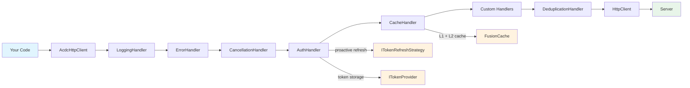

# CSharp-ACDC

Server-only HTTP client library for .NET with authentication, caching, logging, and structured error handling. Uses `DelegatingHandler` pipeline with `IHttpClientFactory`.

## Features

- **Authentication** — OAuth 2.1 token refresh with proactive (before expiry) and reactive (on 401) strategies, concurrent refresh queue, exponential backoff
- **Caching** — FusionCache integration with ETag/If-None-Match, stale-while-revalidate, mutation invalidation, user-isolated cache keys
- **Logging** — Structured logging via `ILogger<T>` with sensitive data redaction, slow request warnings, large payload alerts
- **Error Handling** — Typed exception hierarchy mapping HTTP status codes to specific exception types
- **Cancellation** — Per-request cancellation tokens with bulk `CancelAll()` support
- **Deduplication** — Automatic deduplication of concurrent identical GET and HEAD requests
- **DI-First** — Full `IHttpClientFactory` integration with keyed services and fluent builder API

## Installation

```bash
dotnet add package CSharpAcdc
```

## Quick Start

```csharp
// Zero-config — registers the ACDC pipeline with sensible defaults
builder.Services.AddAcdcHttpClient();

// Inject and use
app.MapGet("/", async (AcdcHttpClient client) =>
{
    var response = await client.GetAsync("https://api.example.com/data");
    return await response.Content.ReadAsStringAsync();
});
```

## Authenticated Client

```csharp
builder.Services.AddAcdcHttpClient(b => b
    .WithAuth(auth =>
    {
        auth.RefreshEndpoint = "https://auth.example.com/oauth/token";
        auth.ClientId = "my-client-id";
        auth.ClientSecret = "my-client-secret";
        auth.RefreshThreshold = TimeSpan.FromSeconds(60);
    })
    .WithBaseAddress(new Uri("https://api.example.com")));
```

Token refresh happens automatically — proactively before expiry and reactively on 401 responses. Concurrent requests share a single refresh call.

## Cached Client

```csharp
builder.Services.AddAcdcHttpClient(b => b
    .WithCache(cache =>
    {
        cache.Duration = TimeSpan.FromMinutes(10);
        cache.ETagEnabled = true;
        cache.CacheKeyStrategy = CacheKeyStrategy.UserIsolated;
        cache.MaxStaleAge = TimeSpan.FromHours(1);
        cache.StaleWhileRevalidateTimeout = TimeSpan.FromSeconds(1);
    }));
```

## Full Pipeline

```csharp
builder.Services.AddAcdcHttpClient(b => b
    .WithAuth(auth =>
    {
        auth.RefreshEndpoint = "https://auth.example.com/oauth/token";
        auth.ClientId = "my-client-id";
    })
    .WithCache(cache =>
    {
        cache.Duration = TimeSpan.FromMinutes(5);
        cache.ETagEnabled = true;
    })
    .WithLogging(logging =>
    {
        logging.SlowRequestThreshold = TimeSpan.FromSeconds(2);
    })
    .WithBaseAddress(new Uri("https://api.example.com"))
    .WithTimeout(TimeSpan.FromSeconds(10)));
```

## Handler Pipeline

Requests and responses flow through a chain of `DelegatingHandler` instances in a fixed order:

```
Request  → [Logging] → [Error] → [Cancellation] → [Auth] → [Cache] → [Custom] → [Dedup] → HttpClient
                                                                                                ↓
Response ← [Logging] ← [Error] ← [Cancellation] ← [Auth] ← [Cache] ← [Custom] ← [Dedup] ← Server
```

| Handler | Purpose |
|---------|---------|
| **Logging** | Logs request/response details with sensitive data redaction |
| **Error** | Converts HTTP errors and exceptions to typed ACDC exceptions |
| **Cancellation** | Tracks active requests for bulk cancellation |
| **Auth** | Injects Bearer token, handles proactive/reactive refresh |
| **Cache** | FusionCache with ETag, SWR, mutation invalidation |
| **Custom** | User-registered `DelegatingHandler` types |
| **Dedup** | Deduplicates concurrent identical GET and HEAD requests |

## Configuration Reference

### AcdcAuthOptions

| Property | Type | Default | Description |
|----------|------|---------|-------------|
| `RefreshEndpoint` | `string` | *(required)* | OAuth token endpoint URL |
| `ClientId` | `string` | *(required)* | OAuth client ID |
| `ClientSecret` | `string?` | `null` | OAuth client secret |
| `RefreshThreshold` | `TimeSpan` | 60s | Time before expiry to trigger proactive refresh |
| `QueueTimeout` | `TimeSpan` | 30s | Max wait time for concurrent refresh queue |
| `RevocationEndpoint` | `string?` | `null` | OAuth token revocation endpoint |

### AcdcCacheOptions

| Property | Type | Default | Description |
|----------|------|---------|-------------|
| `Duration` | `TimeSpan` | 5 min | Cache entry lifetime |
| `ETagEnabled` | `bool` | `true` | Enable ETag/If-None-Match revalidation |
| `CacheKeyStrategy` | `CacheKeyStrategy` | `Shared` | `Shared`, `UserIsolated`, or `NoCache` |
| `MaxStaleAge` | `TimeSpan?` | `null` | Max stale data lifetime (enables fail-safe) |
| `StaleWhileRevalidateTimeout` | `TimeSpan?` | `null` | Timeout before returning stale data (SWR) |
| `BackgroundRefreshOnTimeout` | `bool` | `true` | Continue refresh in background after SWR |

### AcdcLoggingOptions

| Property | Type | Default | Description |
|----------|------|---------|-------------|
| `SlowRequestThreshold` | `TimeSpan` | 3s | Threshold for slow request warnings |
| `LargePayloadThreshold` | `long` | 1 MiB | Threshold for large payload alerts |
| `SensitiveFields` | `IReadOnlySet<string>` | *(see below)* | Header/field names to redact |

### AcdcClientOptions

| Property | Type | Default | Description |
|----------|------|---------|-------------|
| `BaseAddress` | `Uri?` | `null` | Base URL for all requests |
| `Timeout` | `TimeSpan?` | `null` | Request timeout |
| `ClientName` | `string` | `"acdc"` | Named HttpClient identifier |

## Exception Handling

All ACDC exceptions extend `HttpRequestException`, so they integrate naturally with existing error handling:

```
HttpRequestException
  └─ AcdcException (base: URL redaction, response truncation)
       ├─ AcdcAuthException        (401, 403)
       ├─ AcdcClientException      (4xx, has RetryAfter)
       ├─ AcdcServerException      (5xx)
       ├─ AcdcNetworkException     (timeouts, DNS; has NetworkErrorType)
       └─ AcdcCacheException       (cache failures; has CacheOperation)
```

```csharp
try
{
    var response = await client.GetAsync("/api/data");
}
catch (AcdcAuthException ex)
{
    // 401/403 — token expired or insufficient permissions
    logger.LogWarning("Auth failed: {Message}", ex.Message);
}
catch (AcdcServerException ex)
{
    // 5xx — downstream service error
    logger.LogError("Server error {StatusCode}: {Body}", ex.StatusCode, ex.ResponseBody);
}
catch (AcdcNetworkException ex) when (ex.NetworkErrorType == NetworkErrorType.Timeout)
{
    // Request timed out
    logger.LogWarning("Request timed out");
}
catch (AcdcClientException ex)
{
    // 4xx — bad request, not found, etc.
    if (ex.RetryAfter.HasValue)
        await Task.Delay(ex.RetryAfter.Value);
}
```

## Migration from Raw HttpClient

**Before** (raw HttpClient):
```csharp
services.AddHttpClient("api", client =>
{
    client.BaseAddress = new Uri("https://api.example.com");
    client.Timeout = TimeSpan.FromSeconds(10);
});

// Manual token management, no caching, no structured errors...
```

**After** (CSharp-ACDC):
```csharp
services.AddAcdcHttpClient(b => b
    .WithAuth(auth =>
    {
        auth.RefreshEndpoint = "https://auth.example.com/token";
        auth.ClientId = "my-client";
    })
    .WithCache(cache => cache.Duration = TimeSpan.FromMinutes(5))
    .WithBaseAddress(new Uri("https://api.example.com"))
    .WithTimeout(TimeSpan.FromSeconds(10)));

// Auth, caching, logging, error handling — all automatic
```

## Per-Request Options

Override behavior on individual requests using fluent extension methods:

```csharp
var request = new HttpRequestMessage(HttpMethod.Get, "/api/data");
request.SkipCache();                                  // Bypass cache
request.SkipAuth();                                   // Skip auth header
request.WithCacheMaxAge(TimeSpan.FromSeconds(30));    // Custom TTL
request.SkipLogging();                                // Suppress logging
request.SkipDeduplication();                          // Disable dedup

// Methods are chainable:
request.SkipAuth().SkipLogging().WithCacheMaxAge(TimeSpan.FromSeconds(30));
```

The underlying `HttpRequestMessage.Options` keys are also available in `AcdcRequestOptions` for advanced usage.

## Named Clients

Register multiple independent ACDC clients for different downstream services:

```csharp
services.AddAcdcHttpClient("service-a", b => b
    .WithBaseAddress(new Uri("https://service-a.example.com"))
    .WithAuth(auth => { auth.RefreshEndpoint = "..."; auth.ClientId = "a"; }));

services.AddAcdcHttpClient("service-b", b => b
    .WithBaseAddress(new Uri("https://service-b.example.com"))
    .WithCache(cache => cache.Duration = TimeSpan.FromMinutes(10)));

// Resolve by key
var clientA = sp.GetRequiredKeyedService<AcdcHttpClient>("service-a");
```

## Custom Handlers

Register custom `DelegatingHandler` types that run between the Cache and Deduplication handlers in the pipeline:

```csharp
public class CorrelationIdHandler : DelegatingHandler
{
    protected override async Task<HttpResponseMessage> SendAsync(
        HttpRequestMessage request,
        CancellationToken cancellationToken)
    {
        request.Headers.Add("X-Correlation-Id", Guid.NewGuid().ToString());
        return await base.SendAsync(request, cancellationToken);
    }
}

// Register with the builder
builder.Services.AddTransient<CorrelationIdHandler>();
builder.Services.AddAcdcHttpClient(b => b
    .WithCustomHandler<CorrelationIdHandler>());
```

Custom handlers must be registered in DI (`AddTransient` or `AddScoped`) and must not store per-request state in instance fields since handlers are pooled by `IHttpClientFactory`.

## Token Lifecycle

ACDC handles **refreshing** tokens, not **obtaining** them. Your application's login flow provides the initial tokens, and ACDC keeps them alive:

1. **Your login flow** authenticates the user and obtains initial access + refresh tokens
2. **You seed the tokens** via `ITokenProvider.SaveTokensAsync()`
3. **ACDC takes over** — the `AuthHandler` injects the Bearer token on every request and refreshes automatically:
   - **Proactive refresh**: When the access token is within `RefreshThreshold` of expiry (default 60s), ACDC refreshes in the background without blocking the current request
   - **Reactive refresh**: On a 401 response, ACDC refreshes and retries the request once
   - **Concurrent coordination**: Multiple simultaneous 401s share a single refresh call via leader/follower election

The default `InMemoryTokenProvider` stores tokens in memory — tokens are lost on process restart. For persistent storage, implement `ITokenProvider` backed by Redis or a database:

```csharp
public class RedisTokenProvider : ITokenProvider
{
    private readonly IDistributedCache _cache;

    public RedisTokenProvider(IDistributedCache cache) => _cache = cache;

    // Implement GetAccessTokenAsync, SaveTokensAsync, etc.
    // using _cache.GetStringAsync / _cache.SetStringAsync
}

// Register before AddAcdcHttpClient
builder.Services.AddSingleton<ITokenProvider, RedisTokenProvider>();
```

## Debugging and Observability

### Enable Debug Logging

ACDC uses `ILogger<T>` for all handler logging. Set the log level to `Debug` to see handler internals:

```json
{
  "Logging": {
    "LogLevel": {
      "CSharpAcdc": "Debug"
    }
  }
}
```

At `Debug` level you'll see: token refresh attempts, proactive refresh triggers, cache hits/misses, backoff delays, and deduplication joins.

### What Each Handler Logs

| Handler | Information level | Debug level |
|---------|----------|---------|
| **Logging** | Request/response with redacted headers, timing, status code | — |
| **Auth** | — | Token refresh success/failure, proactive refresh triggers, backoff state |
| **Cache** | — | Cache key generation, ETag negotiations |
| **Cancellation** | Cancellation events | — |

### Slow Request and Large Payload Warnings

The `LoggingHandler` emits `Warning`-level logs for:
- **Slow requests**: Requests exceeding `SlowRequestThreshold` (default 3s)
- **Large payloads**: Request or response bodies exceeding `LargePayloadThreshold` (default 1 MiB)

```csharp
builder.Services.AddAcdcHttpClient(b => b
    .WithLogging(logging =>
    {
        logging.SlowRequestThreshold = TimeSpan.FromSeconds(1);
        logging.LargePayloadThreshold = 512 * 1024; // 512 KB
    }));
```

### Sensitive Data Redaction

Headers matching `SensitiveFields` are replaced with `[REDACTED]` in logs. The default list includes `Authorization`, `Cookie`, `X-Api-Key`, and common credential field names. Add custom fields:

```csharp
builder.Services.AddAcdcHttpClient(b => b
    .WithLogging(logging =>
    {
        logging.SensitiveFields = AcdcLoggingOptions.DefaultSensitiveFields
            .Union(new[] { "X-Internal-Token" })
            .ToHashSet(StringComparer.OrdinalIgnoreCase);
    }));
```

## Troubleshooting

### Token refresh keeps failing

1. Enable debug logging for `CSharpAcdc` (see above) to see refresh attempts and error details
2. Check that `RefreshEndpoint` is a valid, reachable URL
3. Verify `ClientId` and `ClientSecret` match your OAuth provider configuration
4. After repeated failures, ACDC applies exponential backoff (1s → 2s → 4s → ... → 30s max). The backoff resets after a successful refresh

### Cache not working

1. Verify cache is configured: `.WithCache(cache => ...)` — without this, no `CacheHandler` is registered
2. Check that requests are `GET` or `HEAD` — other methods bypass the cache
3. Confirm you haven't set `request.SkipCache()` on the request
4. For `UserIsolated` cache keys, the `Authorization` header must be present. Without auth, all requests share the same cache key

### `InvalidOperationException` from `CancelAll()`

`ActiveRequestTracker.CancelAll()` cancels all in-flight requests tracked at call time. This is expected behavior — callers should catch `OperationCanceledException`:

```csharp
try
{
    var response = await client.GetAsync("/api/data");
}
catch (OperationCanceledException)
{
    // Expected after CancelAll() — request was intentionally cancelled
}
```

### Requests fail silently

If requests complete without errors but return unexpected data:
1. Check for `AcdcCacheException` — stale cache entries may be served when the `MaxStaleAge` fail-safe is enabled
2. Enable debug logging to see if cache is returning stale data
3. Verify the handler pipeline is registered: `AddAcdcHttpClient()` must be called in DI setup

### `AcdcAuthException` on startup

ACDC doesn't obtain initial tokens. You must seed them before making authenticated requests:

```csharp
var tokenProvider = app.Services.GetRequiredService<ITokenProvider>();
await tokenProvider.SaveTokensAsync(accessToken, refreshToken, expiresAt, CancellationToken.None);
```

## Security Best Practices

- **Always use HTTPS** — ACDC does not enforce TLS but all `RefreshEndpoint` and `BaseAddress` URLs should use `https://`
- **Never hardcode secrets** — Use `IConfiguration`, environment variables, or a secrets manager (Azure Key Vault, AWS Secrets Manager) for `ClientId` and `ClientSecret`:
  ```csharp
  builder.Services.AddAcdcHttpClient(b => b
      .WithAuth(auth =>
      {
          auth.RefreshEndpoint = builder.Configuration["Auth:TokenEndpoint"]!;
          auth.ClientId = builder.Configuration["Auth:ClientId"]!;
          auth.ClientSecret = builder.Configuration["Auth:ClientSecret"];
      }));
  ```
- **Token storage** — The default `InMemoryTokenProvider` is suitable for development. In production, implement `ITokenProvider` backed by Redis or a database to survive restarts and share tokens across instances
- **Sensitive data redaction** — The `LoggingHandler` redacts `Authorization`, `Cookie`, `X-Api-Key`, and other credential headers by default. Review `AcdcLoggingOptions.DefaultSensitiveFields` and add any application-specific headers
- **Request URL redaction** — Query string parameters matching sensitive field names are also redacted in logs (`?token=abc` becomes `?token=[REDACTED]`)

## Performance Tuning

### Cache Duration

- **Low-latency APIs** (< 100ms): `Duration` of 1-5 minutes reduces upstream load without stale data risk
- **Expensive queries** (> 500ms): `Duration` of 10-30 minutes with `StaleWhileRevalidateTimeout` of 1-2 seconds gives fast responses while refreshing in the background
- **Rarely-changing data** (config, feature flags): `Duration` of 1 hour+ with `MaxStaleAge` set even higher for fail-safe

### Stale-While-Revalidate

`StaleWhileRevalidateTimeout` and `MaxStaleAge` work together:

```csharp
.WithCache(cache =>
{
    cache.Duration = TimeSpan.FromMinutes(5);              // Fresh for 5 min
    cache.MaxStaleAge = TimeSpan.FromHours(1);             // Stale-but-usable for 1 hour
    cache.StaleWhileRevalidateTimeout = TimeSpan.FromSeconds(1); // Return stale after 1s
    cache.BackgroundRefreshOnTimeout = true;               // Refresh continues in background
})
```

If the downstream API takes 3 seconds and the `StaleWhileRevalidateTimeout` is 1 second, the caller gets the stale value after 1 second while the fresh response is fetched and cached in the background.

### Auth Refresh Threshold

`RefreshThreshold` (default 60s) controls how early proactive refresh starts. For high-traffic services, increase to 120-300s to ensure tokens are always fresh under load. For low-traffic services, the default 60s is sufficient.

### Timeouts

Set `WithTimeout()` based on your downstream SLAs. The default is inherited from `HttpClient` (100 seconds). For microservice-to-microservice calls, 5-10 seconds is typical.

### Deduplication

Deduplication applies only to `GET` and `HEAD` requests with identical URL and headers. It's most effective for:
- Dashboard pages that fire multiple identical API calls
- Service meshes where retries create duplicate requests

Disable per-request with `request.SkipDeduplication()` when you need guaranteed fresh responses.

## Architecture



Each handler wraps the next, processing requests left-to-right and responses right-to-left. The `AuthHandler` coordinates with `ITokenProvider` for storage and `ITokenRefreshStrategy` for refresh logic. The `CacheHandler` delegates to FusionCache which manages L1 (in-memory) and optional L2 (Redis) tiers.

## Contributing

1. Fork the repository
2. Create a feature branch
3. Make your changes with tests
4. Submit a pull request

## License

[MIT](LICENSE)
