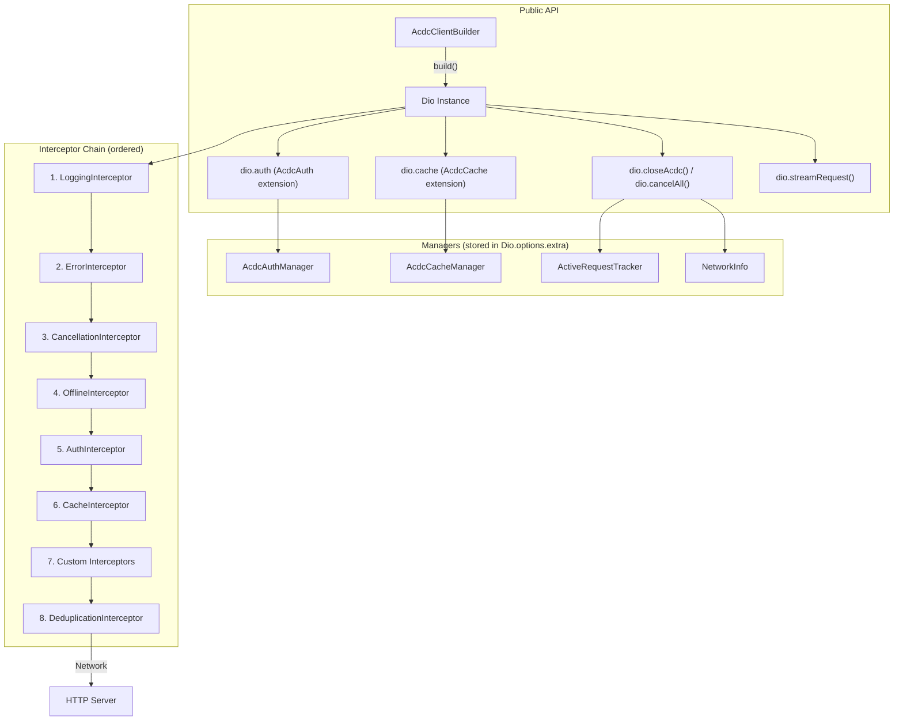
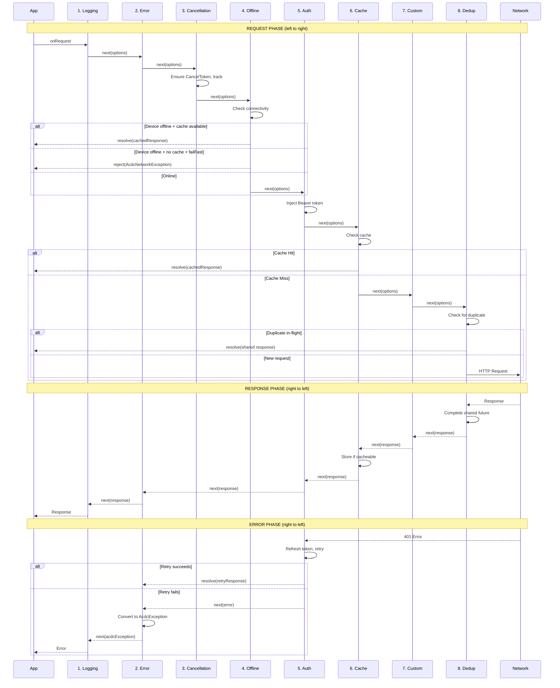

# Dart-ACDC Architecture & Interceptor Chain Analysis

## 1. Overview

**Dart-ACDC** (Authentication, Caching, Debugging, Client) is a production-ready HTTP client library built on top of [Dio](https://pub.dev/packages/dio). It provides a zero-config, opinionated HTTP client for Flutter mobile apps with authentication, caching, logging, and structured error handling.

**Key Design Philosophy:**
- **Composition over Inheritance** -- ACDC does not extend Dio; it builds *on top* of it by configuring interceptors and extensions.
- **Immutable Builder** -- Each configuration method returns a new builder instance.
- **Progressive Disclosure** -- Works with zero config; advanced features opt-in.
- **Strict Layering** -- Interceptors are ordered and decoupled; auth does not know about cache.

---

## 2. High-Level Architecture



---

## 3. Builder Pattern -- `AcdcClientBuilder`

**File:** `lib/src/builder/acdc_client_builder.dart`

### 3.1 Design

The builder is **immutable** -- all `with*` methods return a new `AcdcClientBuilder` instance via a private `_copyWith()` method. The original builder is never mutated.

```dart
class AcdcClientBuilder {
  const AcdcClientBuilder({
    String? baseUrl,
    Duration? timeout,
    TokenProvider? tokenProvider,
    // ... 20+ optional parameters
  }) : _baseUrl = baseUrl,
       _timeout = timeout,
       _tokenProvider = tokenProvider;
       // ...

  AcdcClientBuilder withBaseUrl(String url) => _copyWith(baseUrl: url);
  AcdcClientBuilder withTimeout(Duration timeout) {
    if (timeout.inMicroseconds <= 0) {
      throw ArgumentError('Timeout duration must be positive');
    }
    return _copyWith(timeout: timeout);
  }
  // ...

  AcdcClientBuilder _copyWith({...}) => AcdcClientBuilder(
    baseUrl: baseUrl ?? _baseUrl,
    timeout: timeout ?? _timeout,
    // ... all fields forwarded
  );
}
```

### 3.2 Configuration Options

| Category | Methods | Default |
|----------|---------|---------|
| **Connection** | `withBaseUrl()`, `withTimeout()` | 5s timeout |
| **Auth** | `withTokenProvider()`, `withTokenRefreshEndpoint()`, `withCustomTokenRefresh()`, `withTokenRevocationEndpoint()`, `withTokenRefreshThreshold()`, `withInitialTokens()`, `disableAuth()` | SecureTokenProvider, 60s refresh threshold |
| **Cache** | `withCache()`, `withCacheStore()`, `disableCache()` | Enabled with default CacheConfig |
| **Logging** | `withLogLevel()`, `withLogDelegate()`, `withSensitiveFields()`, `withSlowRequestThreshold()`, `withLargePayloadThreshold()` | LogLevel.info, 3s slow threshold, 1MB payload warning |
| **Network** | `withNetworkInfo()`, `withOfflineDetection()` | Default NetworkInfoImpl, failFast=true |
| **Deduplication** | `withDeduplication()` | Enabled |
| **Security** | `withCertificatePinning()` | None |
| **Custom** | `withInterceptor()` | None |

### 3.3 `build()` Method -- Assembly Sequence

The `build()` method is `async` (returns `Future<Dio>`) because it may need to write initial tokens. The assembly order:

1. **Validate** base URL format
2. **Create Dio** instance
3. **Configure** base URL and timeouts
4. **Certificate pinning** -- Creates custom `IOHttpClientAdapter` with `PinningHttpClient`
5. **Cache interceptor** -- Creates `AcdcCacheInterceptor` with `CacheStore`
6. **Token provider** -- Defaults to `SecureTokenProvider` if none provided
7. **Initial tokens** -- Writes to token provider if provided
8. **Auth interceptor** -- Created if auth not disabled
9. **Cache manager** -- Created and stored in `dio.options.extra`
10. **Auth manager** -- Created with references to tokenProvider, authInterceptor, revocation endpoint, cacheManager
11. **Stored in `dio.options.extra`** -- Both managers stored for extension access
12. **NetworkInfo** -- Initialized and stored
13. **Offline interceptor** -- Created with network info and cache refs
14. **Cancellation interceptor** -- Created with `ActiveRequestTracker`
15. **Interceptor chain** -- Added in specific order (see Section 4)

### 3.4 C# Porting Considerations

| Dart Pattern | C# Equivalent |
|-------------|--------------|
| Immutable builder with `_copyWith()` | Records with `with` expression, or traditional builder pattern with `Clone()` method |
| `const AcdcClientBuilder({...})` constructor | Regular constructor or `init`-only properties |
| `Future<Dio> build()` | `async Task<HttpClient> Build()` or synchronous if no async init needed |
| Named parameters with defaults | Optional parameters with defaults, or options pattern (`AcdcClientOptions`) |
| Dart's null-aware operators (`??`) | C# null-coalescing (`??`) -- identical semantics |

**Recommended C# approach:** Use the **Options Pattern** (`IOptions<AcdcClientOptions>`) combined with a fluent builder that produces a configured `HttpClient` via `IHttpClientFactory`. The builder would register `DelegatingHandler`s in the correct order.

```csharp
// C# equivalent sketch
public class AcdcClientBuilder
{
    private AcdcClientOptions _options = new();

    public AcdcClientBuilder WithBaseUrl(string url) { _options = _options with { BaseUrl = url }; return this; }
    public AcdcClientBuilder WithTimeout(TimeSpan timeout) { _options = _options with { Timeout = timeout }; return this; }

    public HttpClient Build()
    {
        var pipeline = new LoggingHandler(
            new ErrorHandler(
                new CancellationHandler(
                    new OfflineHandler(
                        new AuthHandler(
                            new CacheHandler(
                                new HttpClientHandler()))))));
        return new HttpClient(pipeline) { BaseAddress = new Uri(_options.BaseUrl) };
    }
}
```

---

## 4. Interceptor Chain

### 4.1 Order and Data Flow

The interceptor chain is **critical** to correctness. In Dio, interceptors form a pipeline:
- **Request phase**: Interceptors execute in order (1 -> 2 -> 3 -> ... -> Network)
- **Response phase**: Interceptors execute in reverse order (Network -> ... -> 3 -> 2 -> 1)
- **Error phase**: Same as response (reverse), but only for errors

```
Builder adds interceptors in this order:
  1. LoggingInterceptor        (outer-most)
  2. ErrorInterceptor
  3. CancellationInterceptor
  4. OfflineInterceptor
  5. AuthInterceptor
  6. AcdcCacheInterceptor
  7. Custom interceptors (user-added)
  8. DeduplicationInterceptor  (inner-most)
```



### 4.2 Interceptor Details

#### 4.2.1 LoggingInterceptor

**File:** `lib/src/interceptors/logging_interceptor.dart`

**Purpose:** Outermost interceptor -- logs all requests, responses, and errors.

**Key Features:**
- **Sensitive data redaction** -- Configurable list of field names (default: password, token, secret, etc.)
- **Slow request warnings** -- Configurable threshold (default 3s)
- **Large payload warnings** -- Configurable threshold (default 1MB)
- **Dual output** -- Console printing (optional) + structured delegate
- **Circular dependency prevention** -- Static `_isLogging` flag prevents log-within-log loops
- **Request timing** -- Stores start time in `options.extra['acdc_request_start_time']`

```dart
// Redaction logic
bool _isSensitive(String key) {
  final lowerKey = key.toLowerCase();
  for (final field in sensitiveFields) {
    if (lowerKey.contains(field.toLowerCase())) return true;
  }
  return false;
}
```

**C# Porting:**
- Use `DelegatingHandler` with `ILogger<LoggingHandler>`
- Sensitive data redaction via `Microsoft.Extensions.Compliance.Redaction` or custom `IRedactor`
- Request timing via `Stopwatch` (simpler than storing in `extra`)
- Consider using `HttpMessageHandler` events or `System.Diagnostics.Activity` for correlation

#### 4.2.2 ErrorInterceptor

**File:** `lib/src/interceptors/error_interceptor.dart`

**Purpose:** Converts raw `DioException` into typed ACDC exceptions.

**Mapping:**
| Condition | Exception Type |
|-----------|---------------|
| Network errors (timeout, connection, cancel, DNS) | `AcdcNetworkException` |
| Malformed response (parse error) | `AcdcClientException` |
| 3xx (redirect when disabled) | `AcdcClientException` |
| 401, 403 | `AcdcAuthException` |
| 4xx (others) | `AcdcClientException` |
| 5xx | `AcdcServerException` |

```dart
// Network error detection includes heuristic string matching
bool _isNetworkError(DioException exception) {
  switch (exception.type) {
    case DioExceptionType.connectionTimeout:
    case DioExceptionType.sendTimeout:
    // ...
    case DioExceptionType.unknown:
      if (exception.error != null) {
        final errorStr = exception.error.toString().toLowerCase();
        if (errorStr.contains('socketexception') ||
            errorStr.contains('failed host lookup') ||
            // ... more patterns
        ) return true;
      }
      return false;
  }
}
```

**C# Porting:**
- In .NET, `HttpClient` throws `HttpRequestException`, `TaskCanceledException`, `OperationCanceledException`
- Create a `DelegatingHandler` that catches these and wraps them in ACDC exception types
- Use `HttpResponseMessage.StatusCode` for HTTP status classification
- No need for string-based heuristics -- .NET provides typed exceptions

#### 4.2.3 CancellationInterceptor

**File:** `lib/src/interceptors/cancellation_interceptor.dart`

**Purpose:** Ensures every request has a `CancelToken` and tracks it.

```dart
class CancellationInterceptor extends Interceptor {
  const CancellationInterceptor(this._tracker);
  final ActiveRequestTracker _tracker;

  @override
  void onRequest(RequestOptions options, RequestInterceptorHandler handler) {
    options.cancelToken ??= CancelToken();  // Ensure token exists
    _tracker.add(options.cancelToken!);      // Track it
    handler.next(options);
  }

  @override
  void onResponse(Response response, ResponseInterceptorHandler handler) {
    _removeFromTracker(response.requestOptions);  // Untrack on completion
    handler.next(response);
  }

  @override
  void onError(DioException err, ErrorInterceptorHandler handler) {
    _removeFromTracker(err.requestOptions);  // Untrack on error
    handler.next(err);
  }
}
```

**C# Porting:**
- Use `CancellationToken` / `CancellationTokenSource` (built into .NET)
- Track active `CancellationTokenSource` instances in an `ActiveRequestTracker`
- `DelegatingHandler.SendAsync` receives `CancellationToken` natively
- Consider `LinkedTokenSource` to combine user-supplied and tracker tokens

#### 4.2.4 OfflineInterceptor

**File:** `lib/src/interceptors/offline_interceptor.dart`

**Purpose:** Short-circuits requests when device is offline.

**Flow:**
1. Check `force_network` flag in request options -- bypass if true
2. Check `networkInfo.isConnected` -- proceed if online
3. If offline + cache available -- try to return cached response (even stale)
4. If offline + no cache + `failFast` -- reject with `AcdcNetworkException`
5. If offline + no cache + `!failFast` -- let request proceed (will fail naturally)

```dart
// Extension for clean API
extension OfflineRequestOptions on RequestOptions {
  bool get forceNetwork => extra[OfflineInterceptor.forceNetworkKey] == true;
  set forceNetwork(bool value) { extra[OfflineInterceptor.forceNetworkKey] = value; }
}
```

**C# Porting:**
- **Server-side (.NET):** Offline detection is rarely needed (servers have stable connections). Could be skipped or simplified.
- **Mobile (.NET MAUI):** Use `Microsoft.Maui.Networking.Connectivity.NetworkAccess` or `Xamarin.Essentials.Connectivity`
- Consider `IConnectivity` interface for testability
- Cache fallback logic would be in the same `DelegatingHandler`

#### 4.2.5 AuthInterceptor

**File:** `lib/src/interceptors/auth_interceptor.dart`

**Purpose:** Most complex interceptor -- handles token injection, proactive refresh, reactive refresh, and concurrent request queuing.

**Request Phase (`onRequest`):**
1. Skip if `Authorization` header already exists (manual override)
2. Get access token from `TokenProvider`
3. If no token -- proceed without auth
4. If refresh strategy configured + token near expiry -- proactive refresh
5. Inject `Bearer {token}` header

**Error Phase (`onError`):**
1. Only handles 401 responses
2. If no refresh strategy -- pass through
3. If this is already a retry (`_acdc_retry_after_refresh`) -- clear tokens, fail
4. Attempt refresh via `_refreshTokenWithQueue()`
5. Get new token, inject into original request, mark as retry, re-fetch

**Concurrent Request Queuing:**
```dart
Future<void> _refreshTokenWithQueue() async {
  if (_isRefreshing) {
    // Wait for in-progress refresh (with timeout)
    await _refreshCompleter!.future.timeout(_refreshQueueTimeout,
      onTimeout: () => throw _createAuthException('Token refresh timeout'));
    return;
  }

  _isRefreshing = true;
  _refreshCompleter = Completer<void>();

  try {
    await _performTokenRefresh();
    _refreshCompleter?.complete();
  } catch (e) {
    _refreshCompleter?.completeError(e);
    rethrow;
  } finally {
    _isRefreshing = false;
    _refreshCompleter = null;
  }
}
```

**Token Refresh Strategy Pattern:**
```dart
abstract class TokenRefreshStrategy {
  Future<TokenRefreshResult> refresh(String refreshToken);
}

// Two implementations:
// 1. OAuthTokenRefreshStrategy -- standard OAuth 2.1 endpoint
// 2. CustomTokenRefreshStrategy -- user-provided function
```

**Exponential Backoff:**
```dart
// BackoffManager progression: 1s -> 2s -> 4s -> 8s -> 16s -> 30s (clamped)
void increment({int maxSeconds = 30}) {
  _backoffSeconds = (_backoffSeconds == 0 ? 1 : _backoffSeconds * 2).clamp(0, maxSeconds);
}
```

**C# Porting:**
- This is the most nuanced interceptor to port
- Use `DelegatingHandler` with `SemaphoreSlim` for concurrent queue (instead of `Completer`)
- Strategy pattern maps directly to C# interfaces
- Consider using `Polly` for retry/backoff instead of custom `BackoffManager`
- The retry mechanism (re-sending request after refresh) requires cloning the `HttpRequestMessage`
- **Important:** `HttpRequestMessage` in .NET cannot be sent twice without cloning

```csharp
// C# sketch for concurrent refresh queuing
private readonly SemaphoreSlim _refreshLock = new(1, 1);
private Task? _activeRefresh;

private async Task RefreshTokenWithQueue()
{
    if (_activeRefresh != null)
    {
        await _activeRefresh;
        return;
    }

    await _refreshLock.WaitAsync();
    try
    {
        _activeRefresh = PerformTokenRefresh();
        await _activeRefresh;
    }
    finally
    {
        _activeRefresh = null;
        _refreshLock.Release();
    }
}
```

#### 4.2.6 AcdcCacheInterceptor

**File:** `lib/src/interceptors/cache_interceptor.dart`

**Purpose:** HTTP response caching with user isolation and stale-while-revalidate.

**Key Features:**
- Wraps `dio_cache_interceptor` (third-party package)
- User isolation via `X-ACDC-User-Id` header in cache key
- Stale-while-revalidate (SWR) -- serves stale cache immediately, refreshes in background
- Mutation invalidation -- POST/PUT/DELETE/PATCH clear related cache
- Cache metadata -- `X-ACDC-From-Cache` header, `acdc_source` extra field
- 304 Not Modified handling

**User Isolation Logic:**
```dart
static String buildCacheKeyWithUserIsolation(RequestOptions options, ...) {
  // No auth -> shared cache (baseKey)
  // Auth + user ID -> user-isolated cache (baseKey:userId)
  // Auth but no user ID -> no caching (empty string) -- SECURITY
}
```

**SWR Flow:**
1. On request, check for existing cache entry
2. If found, resolve immediately with stale data
3. Trigger background refresh via `onRefresh` callback
4. Support `streamRequest()` extension to yield both stale and fresh responses

**Custom Handler Classes:**
- `_CacheAwareRequestHandler` -- Intercepts cache hits from `DioCacheInterceptor` to add metadata
- `_CacheAwareErrorHandler` -- Detects offline cache serving and adds `fromOfflineCache` flag

**C# Porting:**
- No direct equivalent of `dio_cache_interceptor` in .NET
- For server-side: Use `Microsoft.Extensions.Caching.Memory.IMemoryCache` or `IDistributedCache`
- For mobile: Consider `Microsoft.Extensions.Caching.Memory` or SQLite-based cache
- User isolation can be implemented via cache key prefix
- SWR requires more custom work -- consider `IAsyncEnumerable<HttpResponseMessage>` for streaming
- **OutputCache** middleware exists in ASP.NET but is server-side only

#### 4.2.7 DeduplicationInterceptor

**File:** `lib/src/interceptors/deduplication_interceptor.dart`

**Purpose:** Deduplicates identical simultaneous GET/HEAD requests.

**Key Generation:**
```dart
String _getRequestKey(RequestOptions options) {
  final sortedHeaders = options.headers.entries.toList()
    ..sort((a, b) => a.key.compareTo(b.key));
  final headersStr = sortedHeaders.map((e) => '${e.key}:${e.value}').join(',');
  return '${options.method}:${options.uri}:$headersStr:${options.data}';
}
```

**Deduplication Rules:**
- Only GET/HEAD requests (idempotent)
- Not stream responses
- Not explicitly disabled via `options.extra['deduplicate'] == false`
- `CancelToken` excluded from key (individual cancellation still works)

**Subscriber Pattern:**
When a duplicate request arrives, it subscribes to the original request's `Completer.future`. If the duplicate's `CancelToken` is cancelled, only the subscriber is rejected -- the primary request continues.

**C# Porting:**
- Use `ConcurrentDictionary<string, Task<HttpResponseMessage>>` for in-flight tracking
- Key generation same approach (method + URL + sorted headers + body hash)
- Response cloning needed since subscribers need independent `HttpResponseMessage` instances
- Consider `SemaphoreSlim` per-key pattern for thread safety

---

## 5. Extensions

### 5.1 Dio Extension Pattern

Dart extensions add methods/properties to existing types. ACDC uses this to add management getters to `Dio`:

**`AcdcAuth` extension** (in `acdc_auth_manager.dart`):
```dart
extension AcdcAuth on Dio {
  AcdcAuthManager get auth {
    final manager = options.extra['_acdc_auth_manager'] as AcdcAuthManager?;
    if (manager == null) throw StateError('No TokenProvider configured.');
    return manager;
  }
}
```

**`AcdcCache` extension** (in `acdc_cache_manager.dart`):
```dart
extension AcdcCache on Dio {
  AcdcCacheManager get cache {
    final manager = options.extra['_acdc_cache_manager'] as AcdcCacheManager?;
    if (manager == null) throw StateError('AcdcCacheManager not initialized.');
    return manager;
  }
}
```

**`AcdcClientExtensions`** (in `acdc_client_extensions.dart`):
```dart
extension AcdcClientExtensions on Dio {
  NetworkInfo? get networkInfo => options.extra['_acdc_network_info'] as NetworkInfo?;
  ActiveRequestTracker? get activeRequestTracker => options.extra['_acdc_active_request_tracker'] as ActiveRequestTracker?;

  void closeAcdc({bool force = false}) {
    close(force: force);
    networkInfo?.dispose();
    activeRequestTracker?.cancelAll();
  }

  void cancelAll([Object? reason]) { activeRequestTracker?.cancelAll(reason); }

  Stream<Response<T>> streamRequest<T>(String path, {...}) async* {
    // Yields cached response then fresh response (SWR)
  }
}
```

### 5.2 Communication via `Dio.options.extra`

The builder stores managers in `dio.options.extra` (a `Map<String, dynamic>`), and extensions retrieve them using well-known keys:

| Key | Value | Extension |
|-----|-------|-----------|
| `_acdc_auth_manager` | `AcdcAuthManager` | `dio.auth` |
| `_acdc_cache_manager` | `AcdcCacheManager` | `dio.cache` |
| `_acdc_network_info` | `NetworkInfo` | `dio.networkInfo` |
| `_acdc_active_request_tracker` | `ActiveRequestTracker` | `dio.activeRequestTracker` |

### 5.3 C# Porting

C# extension methods work similarly:

```csharp
// C# extension equivalent
public static class HttpClientExtensions
{
    // Store managers in a ConditionalWeakTable keyed by HttpClient instance
    private static readonly ConditionalWeakTable<HttpClient, AcdcAuthManager> _authManagers = new();

    public static AcdcAuthManager Auth(this HttpClient client)
    {
        if (!_authManagers.TryGetValue(client, out var manager))
            throw new InvalidOperationException("Auth not configured");
        return manager;
    }
}
```

Alternatively, use a **wrapper class** instead of extensions:
```csharp
public class AcdcHttpClient : IDisposable
{
    public HttpClient HttpClient { get; }
    public AcdcAuthManager Auth { get; }
    public AcdcCacheManager Cache { get; }
    public INetworkInfo NetworkInfo { get; }
}
```

The wrapper approach is cleaner in C# than the `ConditionalWeakTable` approach and avoids the `options.extra` duck-typing pattern.

---

## 6. Cancellation -- `ActiveRequestTracker`

**File:** `lib/src/cancellation/active_request_tracker.dart`

Simple tracking class that maintains a `Set<CancelToken>`:

```dart
class ActiveRequestTracker {
  final Set<CancelToken> _activeTokens = {};

  void add(CancelToken token) => _activeTokens.add(token);
  void remove(CancelToken token) => _activeTokens.remove(token);

  void cancelAll([Object? reason]) {
    final tokens = List<CancelToken>.from(_activeTokens);
    for (final token in tokens) {
      if (!token.isCancelled) token.cancel(reason);
    }
    _activeTokens.clear();
  }

  int get activeCount => _activeTokens.length;
}
```

**Thread Safety Note:** Dart is single-threaded (event loop), so `Set` operations are safe. In C#, use `ConcurrentDictionary` or lock-based synchronization.

**C# Porting:**
```csharp
public class ActiveRequestTracker
{
    private readonly ConcurrentDictionary<CancellationTokenSource, byte> _active = new();

    public CancellationToken Track()
    {
        var cts = new CancellationTokenSource();
        _active.TryAdd(cts, 0);
        return cts.Token;
    }

    public void Untrack(CancellationTokenSource cts) => _active.TryRemove(cts, out _);

    public void CancelAll()
    {
        foreach (var cts in _active.Keys)
        {
            cts.Cancel();
            cts.Dispose();
        }
        _active.Clear();
    }
}
```

---

## 7. Logging System

### 7.1 Log Delegate Interface

**File:** `lib/src/logging/acdc_log_delegate.dart`

```dart
abstract interface class AcdcLogDelegate {
  void log(String message, LogLevel level, Map<String, dynamic> metadata);
}
```

Single method, synchronous interface. The structured `metadata` map contains typed information (request URL, status code, duration, headers, etc.).

### 7.2 Log Levels

**File:** `lib/src/logging/log_level.dart`

```dart
enum LogLevel { debug, info, warning, error, none }
```

### 7.3 C# Porting

Maps directly to .NET:

| Dart | C# |
|------|-----|
| `AcdcLogDelegate` | `ILogger<T>` (built-in) |
| `LogLevel.debug/info/warning/error/none` | `LogLevel.Debug/Information/Warning/Error/None` |
| Metadata map | Structured logging with `{@PropertyName}` templates |

```csharp
// C# uses ILogger natively
_logger.LogInformation("Request: {Method} {Url}", method, url);
_logger.LogWarning("Slow request: {Method} {Url} took {Duration}ms", method, url, duration);
```

---

## 8. Network Info

**File:** `lib/src/network_info/network_info.dart`

```dart
abstract class NetworkInfo {
  bool get isConnected;
  Stream<NetworkStatus> get onStatusChange;
  void dispose();
}

class NetworkInfoImpl implements NetworkInfo {
  // Uses connectivity_plus package
  // Defaults to online to avoid false positives on startup
  // Listens to connectivity changes via stream
}
```

### C# Porting

| Platform | .NET Equivalent |
|----------|----------------|
| Flutter (mobile) | `Microsoft.Maui.Networking.Connectivity` or `Xamarin.Essentials.Connectivity` |
| .NET server | Not typically needed; could use `System.Net.NetworkInformation.NetworkChange` |
| .NET MAUI | `IConnectivity` interface from MAUI Essentials |

```csharp
public interface INetworkInfo : IDisposable
{
    bool IsConnected { get; }
    event EventHandler<NetworkStatusChangedEventArgs>? StatusChanged;
}
```

---

## 9. Public API Surface

**File:** `lib/dart_acdc.dart`

The library barrel file exports exactly these types:

| Category | Exported Types |
|----------|---------------|
| **Builder** | `AcdcClientBuilder` |
| **Auth** | `AcdcAuthManager`, `AcdcAuth`, `SecureTokenProvider`, `TokenProvider`, `TokenRefreshResult` |
| **Cache** | `AcdcCacheManager`, `AcdcCache`, `CacheConfig` |
| **Exceptions** | `AcdcException`, `AcdcAuthException`, `AcdcCacheException`, `AcdcClientException`, `AcdcNetworkException`, `AcdcServerException` |
| **Logging** | `AcdcLogDelegate`, `LogLevel` |
| **Network** | `NetworkInfo`, `NetworkStatus` |
| **Security** | `CertificatePinningConfig` |

Everything else is internal (`src/`) and not accessible to consumers.

---

## 10. Design Patterns Identified

| Pattern | Usage | Dart Implementation |
|---------|-------|-------------------|
| **Builder** | `AcdcClientBuilder` | Immutable builder with `_copyWith()` |
| **Strategy** | `TokenRefreshStrategy` | Abstract class with OAuth and Custom implementations |
| **Chain of Responsibility** | Interceptor chain | Dio's interceptor list (ordered pipeline) |
| **Observer** | `NetworkInfo.onStatusChange` | Dart `Stream<NetworkStatus>` |
| **Facade** | `AcdcAuthManager`, `AcdcCacheManager` | Simplified API over complex subsystems |
| **Decorator/Proxy** | Interceptors wrapping Dio behavior | Each interceptor adds behavior |
| **Template Method** | `Interceptor.onRequest/onResponse/onError` | Override specific phases |
| **Extension Methods** | `dio.auth`, `dio.cache` | Dart extensions on `Dio` |
| **Null Object** | Default `SecureTokenProvider` | Provided when no provider configured |
| **Singleton-like** | `ActiveRequestTracker` per Dio instance | Stored in `options.extra` |

---

## 11. Server-Side vs Mobile Considerations

| Feature | Mobile (Flutter/MAUI) | Server-Side (.NET) |
|---------|-------------------|--------------------|
| **Token Storage** | Keychain / Keystore / SecureStorage | Environment variables, Azure Key Vault, or in-memory |
| **Network Info** | `connectivity_plus` / MAUI Connectivity | Rarely needed; assume always connected |
| **Offline Support** | Critical -- mobile devices go offline | Usually N/A |
| **Certificate Pinning** | Important for mobile security | Typically handled at infrastructure level (reverse proxy) |
| **Cache Storage** | SQLite, Hive, file-based | Redis, IMemoryCache, IDistributedCache |
| **Deduplication** | Useful for UI-driven duplicate calls | Useful for microservice fan-out |
| **Logging** | Console + Crashlytics/Datadog | Serilog, Application Insights, OpenTelemetry |
| **Timeouts** | 5-30s typical | 30-120s typical for inter-service |
| **Retry/Backoff** | Must be battery-aware | Can be more aggressive |

---

## 12. Key C# Porting Mapping Summary

| Dart / Dio Concept | C# / .NET Equivalent |
|-------------------|---------------------|
| `Dio` | `HttpClient` (with `DelegatingHandler` pipeline) |
| `Interceptor` | `DelegatingHandler` |
| `RequestOptions` | `HttpRequestMessage` |
| `Response` | `HttpResponseMessage` |
| `DioException` | `HttpRequestException` / custom exception hierarchy |
| `CancelToken` | `CancellationToken` / `CancellationTokenSource` |
| `Interceptor.onRequest` | `DelegatingHandler.SendAsync` (before `base.SendAsync`) |
| `Interceptor.onResponse` | `DelegatingHandler.SendAsync` (after `base.SendAsync`) |
| `Interceptor.onError` | `try/catch` around `base.SendAsync` |
| `handler.next(options)` | `await base.SendAsync(request, cancellationToken)` |
| `handler.resolve(response)` | Return `HttpResponseMessage` directly (short-circuit) |
| `handler.reject(error)` | `throw` exception |
| Dart extensions | C# extension methods |
| `Dio.options.extra` | `HttpRequestMessage.Options` dictionary or wrapper class |
| `Stream<T>` | `IAsyncEnumerable<T>` or `IObservable<T>` |
| `Completer<T>` | `TaskCompletionSource<T>` |
| `connectivity_plus` | `IConnectivity` (MAUI) or `NetworkChange` (.NET) |
| `dio_cache_interceptor` | Custom cache handler with `IMemoryCache` / `IDistributedCache` |
| `flutter_secure_storage` | `SecureStorage` (MAUI) or `IDataProtectionProvider` (.NET) |

---

## 13. Risks and Complexity Hotspots for Porting

1. **AuthInterceptor concurrent queuing** -- The `Completer`-based queue is the most complex piece. C# equivalent using `TaskCompletionSource` + `SemaphoreSlim` needs careful testing.

2. **Cache interceptor wrapping** -- Dart-ACDC wraps `dio_cache_interceptor`. In C#, this needs to be built from scratch using `IMemoryCache` or a custom store, including Cache-Control parsing, ETag support, and SWR.

3. **Request retry after 401** -- In .NET, `HttpRequestMessage` cannot be sent twice. Must clone/rebuild the request for retry.

4. **Extension-based manager access** -- The `options.extra` dictionary pattern is fragile. C# should prefer a typed wrapper class.

5. **Offline detection** -- Less relevant for server-side but critical for MAUI. Should be behind an interface with platform-specific implementations.

6. **Interceptor ordering** -- .NET `DelegatingHandler` chain is explicit (handler wraps handler), making ordering more visible but also more verbose to set up.
